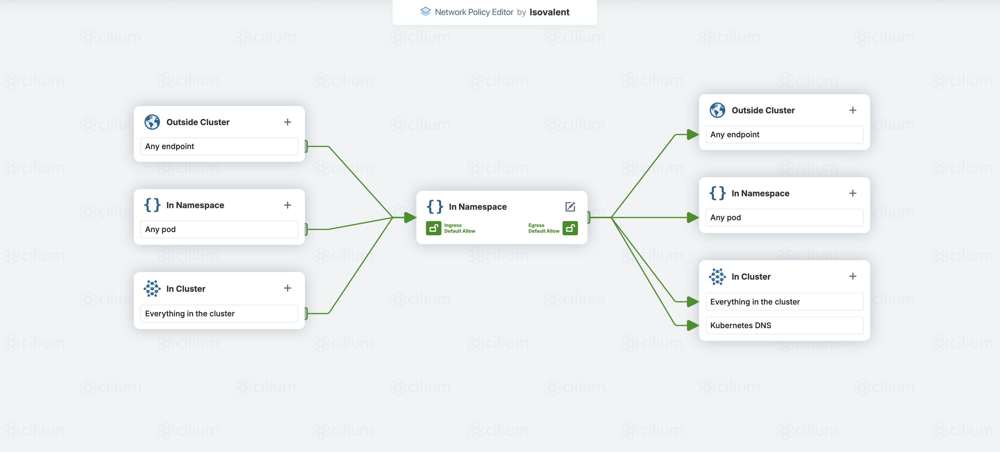

# CiliumNetworkPolicy Visualizer

## Overview

A `kubectl` plugin that fetches a given `CiliumNetworkPolicy` resource from the cluster, uploads it to `editor.networkpolicy.io` to generate a diagram, and saves the diagram locally.



## Installation

### Manual Installation

1. Download the latest release from GitHub Releases.

2. Move the binary to a directory in your `$PATH`, for example:

```
mv kubectl-cnp-viz /usr/local/bin/ubectl-cnp_viz
chmod +x /usr/local/bin/kubectl-cnp_viz
```

## Usage

### Visualize a given network policy

```
kubectl cnp-viz -n my-namespace service-np
```

### Resize the diagram

```
kubectl cnp-viz -n my-namespace service-np --scale 2
```

### Move the diagram horizontally

```
kubectl cnp-viz -n my-namespace service-np --x 600
```

### Move the diagram vertically

```
kubectl cnp-viz -n my-namespace service-np --y 50
```

### Set custom output path

```
kubectl cnp-viz -n my-namespace service-np --output ~/diagrams
```

## License

This plugin is open-source and available under the Apache 2.0 License.
